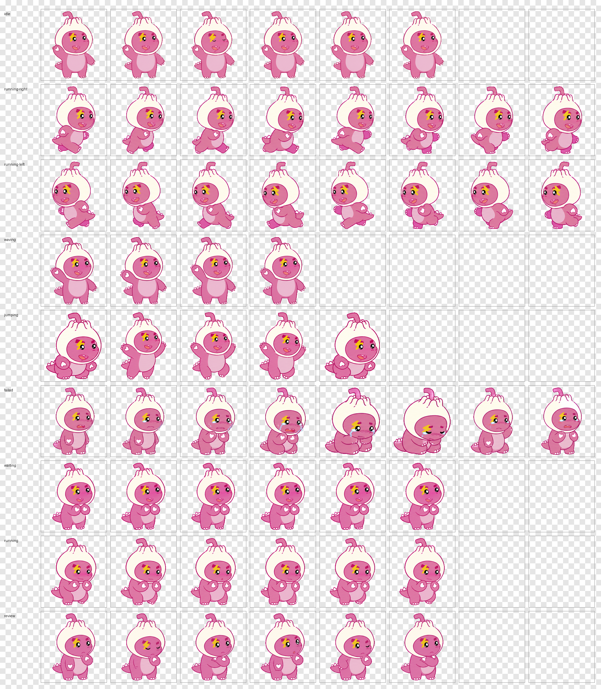

# Baozi Sulong Codex Pet

汪苏泷「罗曼星球 ROMANOVA」包子头套素龙风格的 Codex Pet。


## Preview

| Idle | Run Right | Run Left |
| --- | --- | --- |
|  |  |  |

| Wave | Jump | Fail |
| --- | --- | --- |
|  |  |  |

| Wait | Work | Review |
| --- | --- | --- |
|  |  |  |

完整 contact sheet:



## Install

把这个仓库下载到本地后，将 `pet.json` 和 `spritesheet.webp` 放到 Codex pets 目录中的同一个子目录里。

### Windows

```powershell
New-Item -ItemType Directory -Force -Path "$env:USERPROFILE\.codex\pets\baozisulong"
Copy-Item .\pet.json "$env:USERPROFILE\.codex\pets\baozisulong\pet.json" -Force
Copy-Item .\spritesheet.webp "$env:USERPROFILE\.codex\pets\baozisulong\spritesheet.webp" -Force
```

### macOS / Linux

```bash
mkdir -p ~/.codex/pets/baozisulong
cp pet.json ~/.codex/pets/baozisulong/pet.json
cp spritesheet.webp ~/.codex/pets/baozisulong/spritesheet.webp
```

然后重启 Codex，在 Pet 设置里选择 `Baozi Sulong`。

## Files

- `pet.json`: Codex pet manifest
- `spritesheet.webp`: 8 x 9 animation atlas
- `assets/previews/*.gif`: each animation state preview
- `assets/contact-sheet.png`: full QA contact sheet
- `assets/xhs-live/romanova-sulong-live.mp4`: short video preview for social posting
- `assets/xhs-live/romanova-sulong-live.mov`: Live Photo conversion friendly version
- `assets/xhs-live/romanova-sulong-live-cover.jpg`: cover image

## Xiaohongshu Copy

```text
把汪苏泷罗曼星球的包子头套素龙，做成了一只会陪我写代码的 Codex Pet。

会发呆、会跑动、会挥手、会等待、会认真工作，甚至还有失败和 review 状态。
以后打开 Codex，不只是 AI 在干活，素龙也在旁边陪工。

GitHub:
https://github.com/Windyskr/baozisulong-codex-pet

安装方式：
1. 打开 GitHub 下载 pet 包
2. 放到 ~/.codex/pets/baozisulong
3. 重启 Codex，在 Pet 设置里选择它

#汪苏泷 #罗曼星球 #ROMANOVA #Codex #AI工具 #桌面宠物 #程序员日常
```

